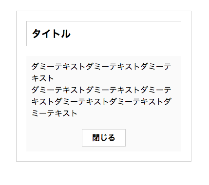
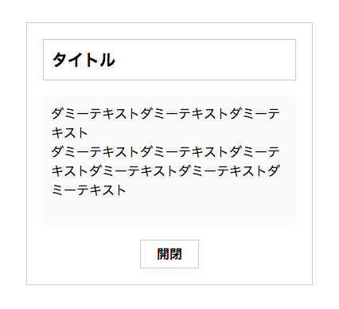

# jQueryでDOM探索をする場合は、コンポーネントルートからの子孫方向への探索にとどめた方が良いという話に関して

この前Qiitaでバズった[jQueryで楽になる部分、楽にならない部分、顧客が本当に必要だったもの](http://qiita.com/mizchi/items/2a7623bda048275b64a8)という記事に関して、「jQueryのセレクタを使う場合は下方向の探索(find)のみを使う」という部分が気になったので自分のなかでまとめ。

# 親方向の探索を使った場合に問題になるパターン

例えば、ボタンを押すとコンテンツが開閉するよくあるやつを作りたいとします。


## 最初の仕様

最初の仕様では



のようなデザインで、その際に以下のようにコーディングしたとします。

```
<div class="m_collapse">
  <p class="m_collapse__tit">タイトル</p>
  <div class="m_collapse__content">
    <p class="m_collapse__txt">
      ダミーテキストダミーテキスト<br>
      ダミーテキスト
    </p>
    <!-- /.m_collapse__txt -->
    <p class="m_collapse__btn">閉じる</p>
  </div>
  <!-- /.m_collapse__content -->
</div>
<!-- /.m_collapse -->
```

```
$(function() {
  $('.m_collapse__btn').on('click', function() {
    $(this).closest('.m_collapse__content').slideToggle();
  });
});
```

JSは問題が発生する部分に焦点を絞るために閉じるボタンの部分のソースだけ記述します。

元記事でタブーとされた「closest」を使用し、親方向の探索を利用して処理を書いています。


## 仕様変更

ところが、仕様変更となり、



のようなデザインに変わってしまったとします。

この場合HTML、JS共に修正する必要が発生し、

```
<div class="m_collapse">
  <p class="m_collapse__tit">タイトル</p>
  <div class="m_collapse__content">
    <p class="m_collapse__txt">
      ダミーテキストダミーテキスト<br>
      ダミーテキスト
    </p>
    <!-- /.m_collapse__txt -->
  </div>
  <!-- /.m_collapse__content -->
  <p class="m_collapse__btn">開閉</p>
</div>
<!-- /.m_collapse -->
```

```
$(function() {
  $('.m_collapse__btn').on('click', function() {
    $(this).closest('.m_collapse').find('.m_collapse__content').slideToggle();
  });
});
```

のような形に書き直す必要があります。

## JSはこのように書けば書き直す必要はなかった

HTMLに関してはどうしようもないのですが、少なくともJSに関しては以下のように最初に記述しておけば仕様変更に伴いソースを修正する必要は生じませんでした。

```
$(function() {
  var $module  = $('.m_collapse');
  var $content = $module.find('.m_collapse__content');
  var $btn     = $module.find('.m_collapse__btn');

  $btn.on('click', function() {
    $content.slideToggle();
  });
});
```

このパターンでは「closest」のような親方向の探索を使用せず、コンポーネントのルートである「.m_collapse」からの子孫方向への探索のみを利用しています。

「JSを弄らないで済むようにHTML/CSSを弄れば良い」なんて話もありそうですが、JSの内部実装をより意識しないといけないという時点でやはり親方向の探索を使用した手法は劣ってしまいますよね。

# 結論

DOM要素同士の位置関係なんてものはデザインの都合で頻繁に変わってしまうので、DOM要素同士の位置関係に依存したコードを書いてしまうと変更に非常に弱くなってしまうんですね。

親、兄弟要素の探索を使う前に「これは変更に弱くなる可能性が非常に高いが、それでもいいのか？」という問いかけをする必要がある、ということは認識しないといけないですね。
